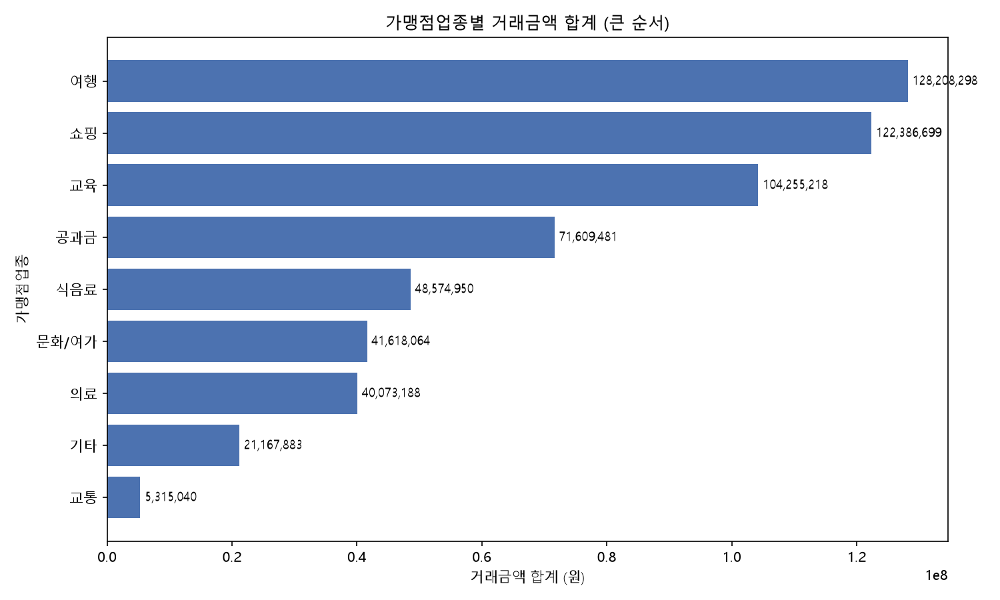
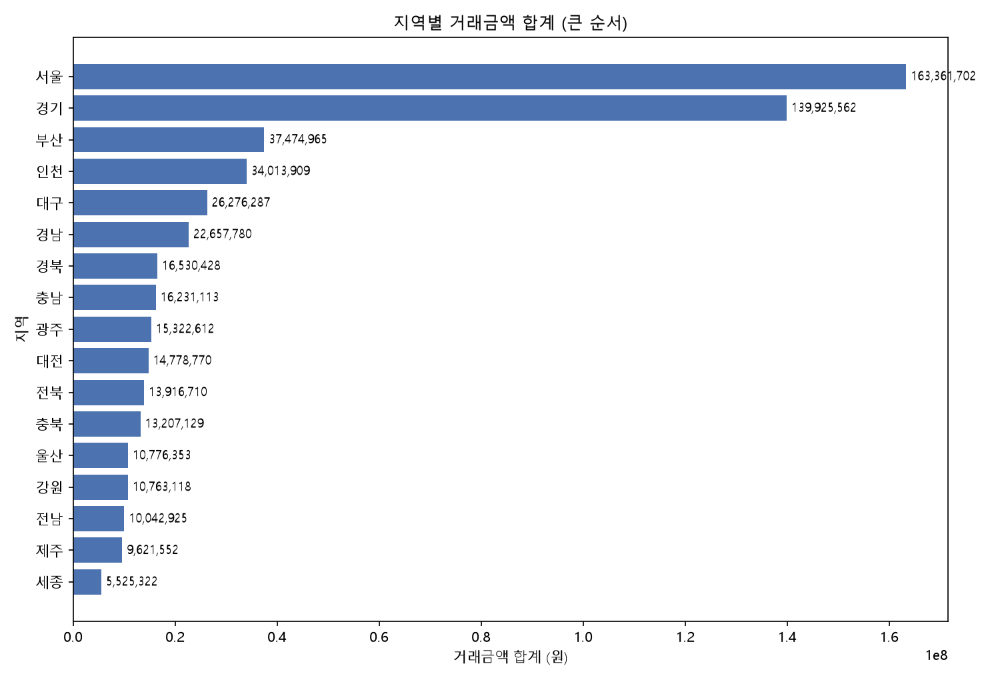
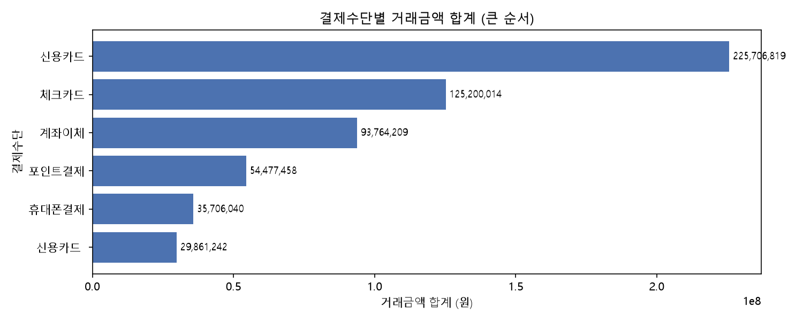
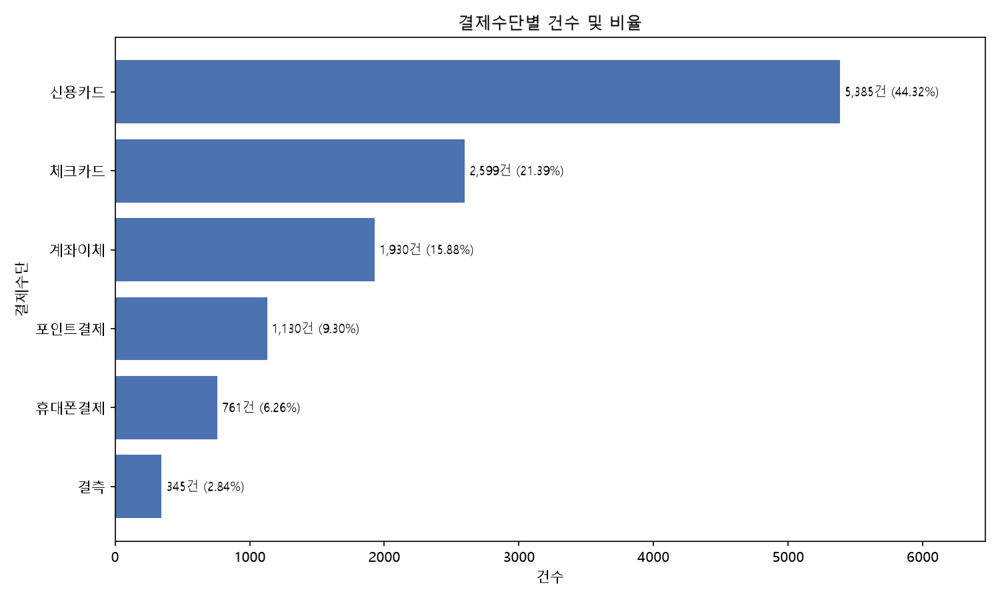
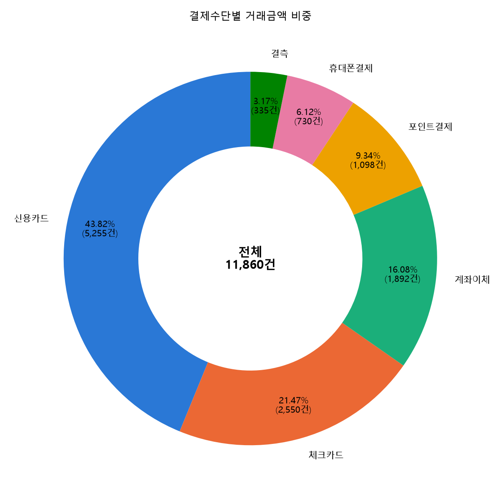
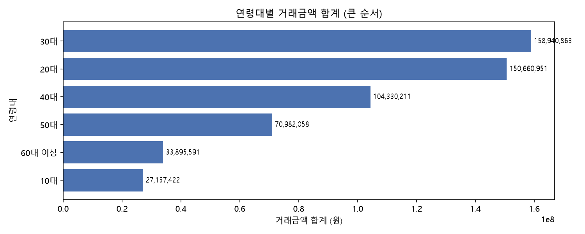
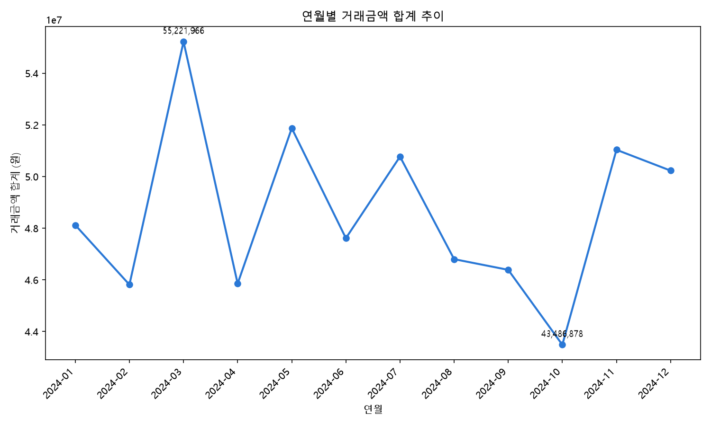

# 핀테크 결제 데이터 그래프 분석 보고서

데이터: `data/01_핀테크결제_dirty.csv` (음수 거래금액 25건 제외 후 집계) / 도넛차트는 `data/핀테크_정제완료.csv` 기준(11,713건)

**2026-08-14 갱신**: 이전 버전은 환불·오류로 보이는 음수 거래금액(25건)이 집계에 그대로 섞여 있어 모든 합계가 실제보다 낮게 나왔다. 이번 버전은 음수를 제외하고 다시 집계했다.

---

## 1. 가맹점업종별 거래금액 합계

| 업종 | 합계(원) |
|---|---|
| 여행 | 128,208,298 |
| 쇼핑 | 122,386,699 |
| 교육 | 104,255,218 |
| 공과금 | 71,609,481 |
| 식음료 | 48,574,950 |
| 문화/여가 | 41,618,064 |
| 의료 | 40,073,188 |
| 기타 | 21,167,883 |
| 교통 | 5,315,040 |

**시사점**: 여행·쇼핑·교육 상위 3개 업종이 전체 거래금액의 절반 이상을 차지한다. 교통은 결제 건수는 많지만 건당 금액이 작아 총액 기준으로는 가장 낮다 — 순위는 음수 제외 전후로 바뀌지 않았다.

---

## 2. 지역별 거래금액 합계

| 지역 | 합계(원) |
|---|---|
| 서울 | 163,361,702 |
| 경기 | 139,925,562 |
| 부산 | 37,474,965 |
| 세종(최하위) | 5,525,322 |

**시사점**: 서울·경기 두 지역이 전체의 절반 이상을 차지하는 수도권 쏠림 현상은 음수 제외 후에도 그대로 유지된다.

---

## 3. 결제수단별 거래금액 합계

| 결제수단 | 합계(원) |
|---|---|
| 신용카드 | 225,706,819 |
| 체크카드 | 125,200,014 |
| 계좌이체 | 93,764,209 |
| 포인트결제 | 54,477,458 |
| 휴대폰결제 | 35,706,040 |
| ` 신용카드`(공백 포함) | 29,861,242 |

**시사점**: 신용카드가 압도적 1위다. 이 그래프는 원본 표기(공백 포함 `' 신용카드'` 별도 항목) 그대로 집계한 것이라 실제 비중은 5번 도넛차트를 참고할 것.

---

## 4. 결제수단별 건수 및 비율

건수는 거래금액이 아니라 결제수단 표기 자체를 세는 것이라 음수 거래 제외의 영향을 받지 않는다 (이전과 동일: 신용카드 44.32%, 체크카드 21.39%, 계좌이체 15.88%, 포인트결제 9.30%, 휴대폰결제 6.26%, 결측 2.84%).

---

## 5. 결제수단별 거래금액 비중 (도넛차트)

| 결제수단 | 합계(원) | 비중 | 건수 |
|---|---|---|---|
| 신용카드 | 255,568,061 | 43.82% | 5,255 |
| 체크카드 | 125,200,014 | 21.47% | 2,550 |
| 계좌이체 | 93,764,209 | 16.08% | 1,892 |
| 포인트결제 | 54,477,458 | 9.34% | 1,098 |
| 휴대폰결제 | 35,706,040 | 6.12% | 730 |
| 결측 | 18,493,039 | 3.17% | 335 |
| **전체** | **583,208,821** | **100%** | **11,860** |

**시사점**: 음수를 제외하고 나니 전체 건수가 11,885 → 11,860건으로 25건 줄었고, 합계도 581.7M → 583.2M원으로 늘었다(음수가 총액을 깎아먹고 있었다는 뜻). 비중 자체는 이전과 거의 동일해 순위·구조에는 큰 영향이 없었다.

---

## 6. 연령대별 거래금액 합계

| 연령대 | 합계(원) |
|---|---|
| 30대 | 158,940,863 |
| 20대 | 150,660,951 |
| 40대 | 104,330,211 |
| 50대 | 70,982,058 |
| 60대 이상 | 33,895,591 |
| 10대 | 27,137,422 |

**시사점**: 20~30대 중심 구조는 음수 제외 후에도 그대로다.

---

## 7. 연월별 거래금액 합계 추이

**시사점**: 최댓값은 3월(55.2M), 최솟값은 10월(43.5M)로 이전과 순위가 같다. 음수 제외로 각 월 합계가 소폭 올라갔을 뿐 추세 자체(뚜렷한 계절성 없음)는 달라지지 않았다.

---

## 종합 요약

- 음수 거래금액(25건, 최대 -624,340원)을 제외하고 다시 집계한 결과, **순위·구조적 결론은 이전 보고서와 동일**했다 — 즉 음수는 총액을 소폭 낮추는 효과만 있었고, 어느 카테고리가 크고 작은지의 순서를 바꾸지는 않았다.
- 업종·지역·연령대 모두 뚜렷한 쏠림(여행/쇼핑, 서울/경기, 20~30대)이 있어 상위 카테고리 중심 전략이 유효해 보인다.
- 결제수단은 신용카드 비중이 압도적이지만, 원본 데이터의 공백 표기 문제 때문에 정리 전/후 집계 결과가 달라진다는 점을 유의해야 한다.
- 시간 흐름(연월)에는 특별한 추세가 없어, 계절성보다는 카테고리·지역·연령 요인이 거래금액을 설명하는 더 중요한 변수로 보인다.
