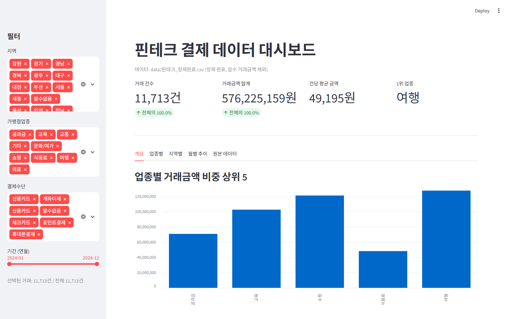
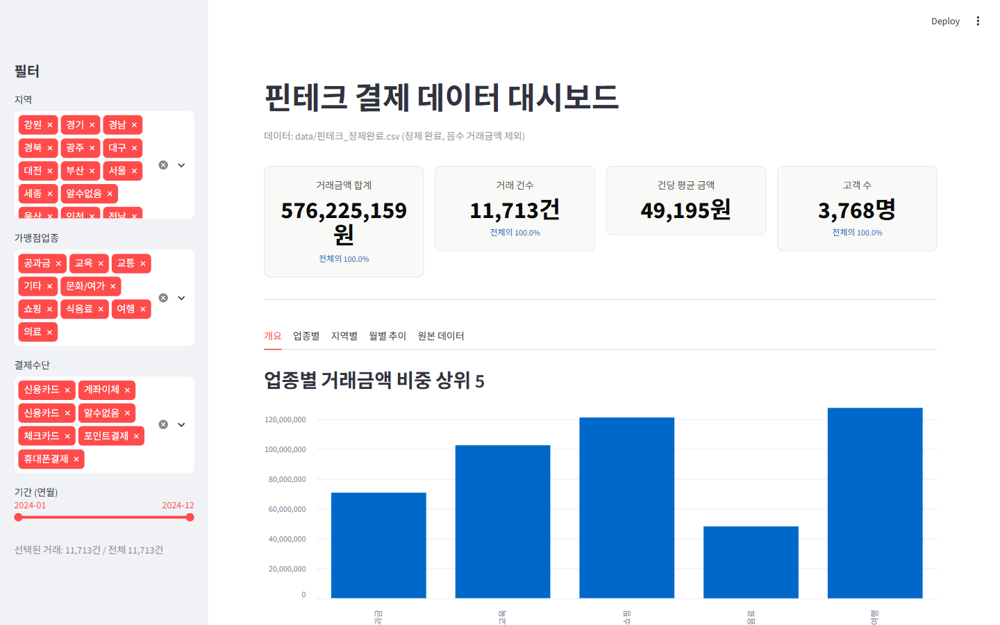
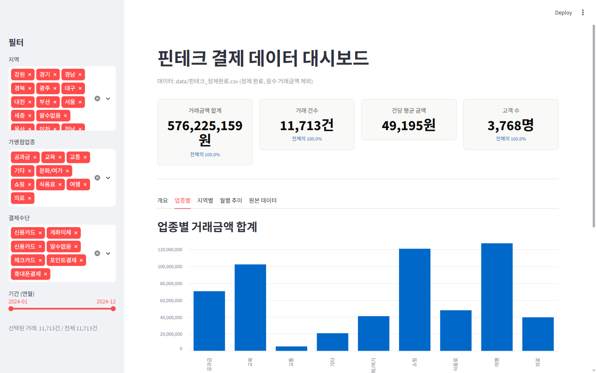
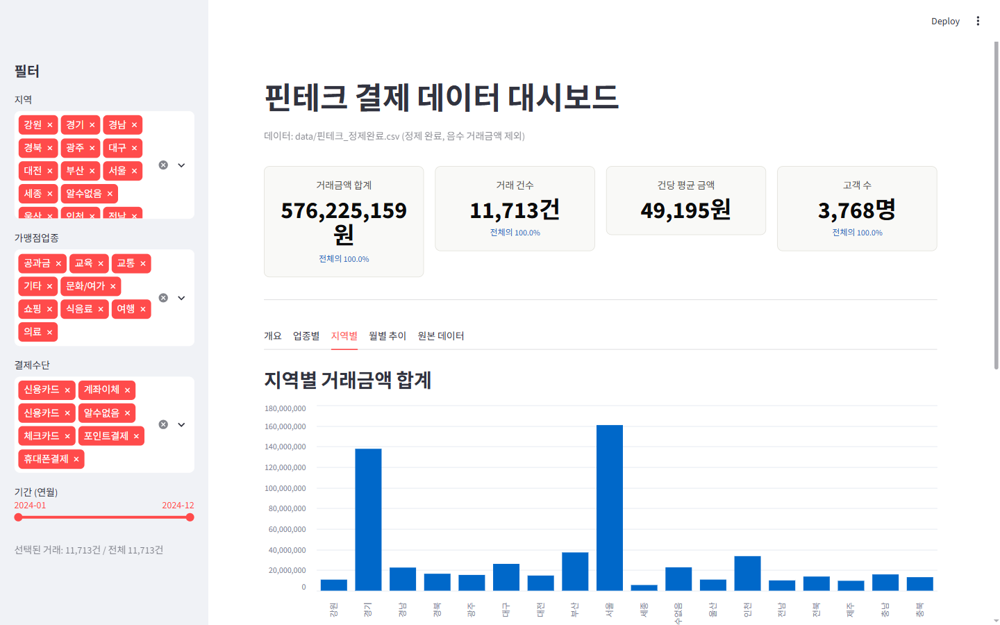
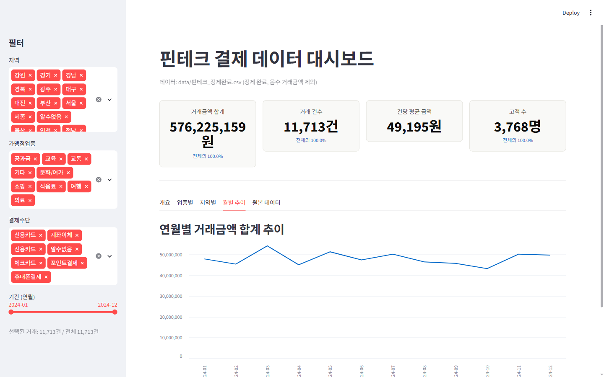
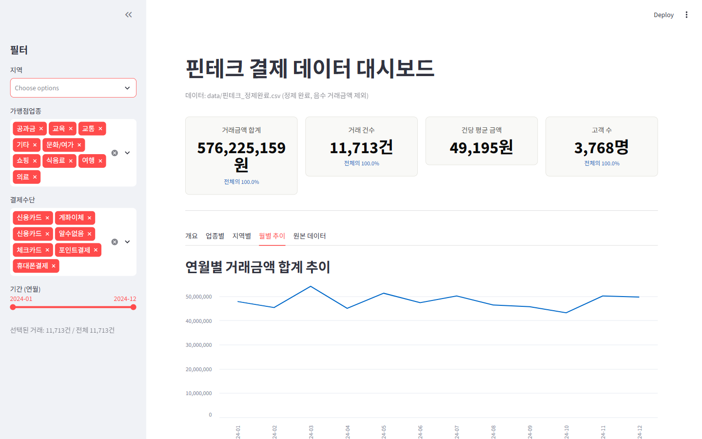

# 핀테크 결제 대시보드 사용자 테스트 보고서

대상: `scripts/대시보드.py` (Streamlit, `http://localhost:8501`)
도구: Playwright (자동 클릭·캡처·영상 녹화)

---

## 1. 초기 화면 (개요 탭)

사이드바에 지역·업종·결제수단·기간 필터가 모두 "전체 선택" 상태로 시작하고, 개요 탭에는 업종별 상위 5·결제수단별 건수 차트가 바로 보인다.

## 2. KPI 카드 (총액·건수·평균·고객 수)

- 거래금액 합계: 576,225,159원
- 거래 건수: 11,713건
- 건당 평균 금액: 49,195원
- 고객 수: 3,768명

4개 지표를 큰 글씨 카드로 강조해서 화면 진입 즉시 핵심 숫자가 눈에 들어온다.

## 3. 업종별 탭

업종별 거래금액 합계 막대그래프와 표가 함께 나온다. `st.bar_chart`라 마우스를 올리면 값이 뜬다.

## 4. 지역별 탭

지역별 거래금액 합계. 지역 수가 많아도 스크롤 없이 한 화면에 들어온다.

## 5. 월별 추이 탭

연월별 거래금액 합계를 라인차트로 보여준다.

## 6. 필터 전체 해제 테스트

**시나리오**: 지역 멀티셀렉트에서 "Clear all"로 전부 지워봤다.

**결과**: 화면이 비지 않고 선택된 거래가 여전히 "11,713건 / 전체 11,713건"으로 표시된다 — 즉 지역을 하나도 안 고르면 자동으로 "전체 지역을 고른 것"처럼 처리된다. KPI·그래프 모두 정상 유지됨을 확인했다. 사용자가 실수로 필터를 다 지워도 빈 화면 때문에 당황할 일이 없다.

## 7. 화면 녹화 영상

`ui_test/video/사용자테스트_녹화.webm` — 개요→업종별→지역별→월별 추이→원본 데이터 탭을 순서대로 넘기고 지역 필터를 열어보는 과정을 담았다. (webm 포맷, 브라우저나 대부분의 동영상 플레이어에서 재생 가능)

## 종합 평가

- 필터를 비우는 예외 상황에서도 대시보드가 깨지지 않고 안전하게 동작한다.
- 탭 전환·KPI 표시·차트 렌더링 모두 정상 작동을 확인했다.
- 결제수단 필터 목록에 공백 포함 `'신용카드 '`와 정상 `'신용카드'`가 별개 항목으로 남아있는 게 눈에 띈다 — 정제 파일 자체에 남아있는 표기 문제라 대시보드 버그는 아니지만, 사용자가 필터 목록에서 헷갈릴 수 있으니 향후 개선 여지가 있다.
