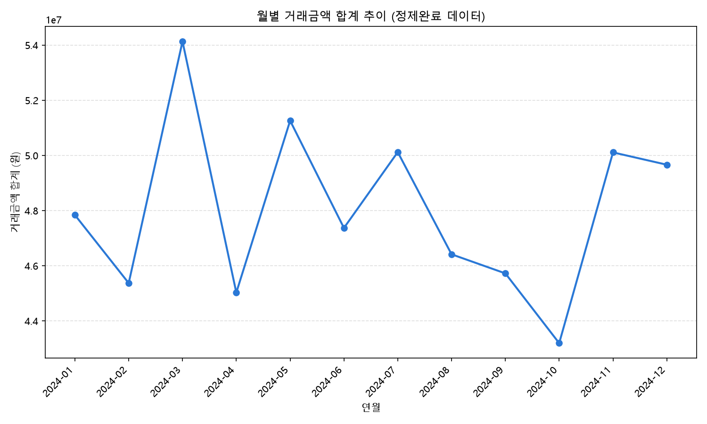

# 핀테크 결제 월간 보고서 (초안) — 2024년 연간 월별 추이

데이터: `data/핀테크_정제완료.csv` (정제 완료, 음수 거래금액 제외, 11,713건)
근거 표(CSV): `output/월별_요약.csv`

---

## 월별 요약 표

| 연월 | 거래금액 합계(원) | 거래건수 | 고객수 | 건당평균(원) | 전월대비 증감(%) | 1위 업종 |
|---|---|---|---|---|---|---|
| 2024-01 | 47,840,867 | 992 | 877 | 48,227 | - | 쇼핑 |
| 2024-02 | 45,370,905 | 941 | 862 | 48,216 | -5.16 | 여행 |
| 2024-03 | 54,130,881 | 991 | 870 | 54,622 | +19.31 | 여행 |
| 2024-04 | 45,027,918 | 944 | 845 | 47,699 | -16.82 | 쇼핑 |
| 2024-05 | 51,258,732 | 963 | 858 | 53,228 | +13.84 | 여행 |
| 2024-06 | 47,370,405 | 940 | 842 | 50,394 | -7.59 | 여행 |
| 2024-07 | 50,119,647 | 1,032 | 908 | 48,566 | +5.80 | 쇼핑 |
| 2024-08 | 46,415,176 | 980 | 876 | 47,362 | -7.39 | 여행 |
| 2024-09 | 45,723,535 | 960 | 842 | 47,629 | -1.49 | 쇼핑 |
| 2024-10 | 43,194,441 | 976 | 862 | 44,257 | -5.53 | 쇼핑 |
| 2024-11 | 50,109,649 | 995 | 889 | 50,361 | +16.01 | 여행 |
| 2024-12 | 49,663,003 | 999 | 874 | 49,713 | -0.89 | 쇼핑 |
| **연간 합계** | **576,225,159** | **11,713** | - | - | - | - |

---

## 발견

- **최고월/최저월**: 2024-03(54,130,881원)이 최고, 2024-10(43,194,441원)이 최저다. 둘의 차이는 10,936,440원이다.
- **전월대비 증감 폭이 가장 컸던 달**: 2024-03 +19.31%(최대 증가), 2024-04 -16.82%(최대 감소) — 두 달이 연달아 크게 오르고 내렸다.
- **1위 업종은 여행과 쇼핑이 6개월씩 번갈아** 차지했다 (여행: 2·3·5·6·8·11월 / 쇼핑: 1·4·7·9·10·12월).
- **거래건수는 940~1,032건 사이, 고객수는 842~908명 사이**로 월별 변동폭이 크지 않다.
- **건당평균은 44,257원(10월, 최저)~54,622원(3월, 최고)** 사이에서 움직인다.

## 의미

전체 흐름은 뚜렷한 상승·하락 추세 없이 매달 43~55M원 사이에서 등락하는 **안정적인 패턴**이다. 다만 3월과 4월처럼 전월대비 두 자릿수 증감이 연달아 나타난 구간이 있어, 거래금액 합계만 볼 게 아니라 전월대비 증감률도 같이 봐야 급격한 변화를 놓치지 않는다. 거래건수·고객수 변동이 크지 않은데도 거래금액 증감이 크다는 것은(예: 3월 건수 991건은 1월 992건과 거의 같은데 금액은 훨씬 큼) **건당 결제 단가(건당평균)의 변화가 월별 금액 등락의 주요 원인**이라는 뜻이다. 실제로 3월 건당평균(54,622원)이 연중 최고치다.

## 액션

1. **3월·11월처럼 건당평균이 높은 달의 원인(여행 성수기 등)을 파악**해서, 재현 가능한 패턴이면 다음 해 같은 시기 프로모션을 강화한다.
2. **10월처럼 건당평균이 낮은 달**은 소액 결제 유도(포인트 적립 이벤트 등)로 건수를 늘리는 전략이 유효할 수 있다.
3. **여행/쇼핑이 번갈아 1위**를 차지하는 패턴이 있으므로, 월별 1위 업종에 맞춘 시즌별 배너·프로모션을 미리 준비한다.
4. 다음 보고서부터는 이번 표를 템플릿으로 두고, 신규 월 데이터가 들어올 때마다 `output/월별_요약.csv`를 갱신해 전월대비 증감을 계속 추적한다.
