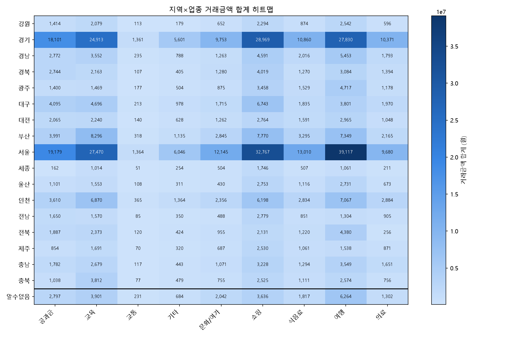

# 지역×업종 거래금액 히트맵 분석 보고서

데이터: `data/핀테크_정제완료.csv` (정제 완료, 음수 거래금액 제외 반영, 11,713건)

**2026-08-14 갱신**: 정제 파일에 4단계(음수 거래금액 제거)가 추가되어 11,738 → 11,713건으로 줄었다. 아래 수치는 전부 갱신된 파일 기준이다.

---

## 1. 전체 구조

지역 17개(실제 지역, 가나다순) × 업종 9개를 교차 집계했다. `알수없음`(지역 결측 대체값)은 실제 지역과 순위 비교에 섞이지 않도록 히트맵 맨 아래 구분선 밑에 별도로 배치했다.

## 2. 가장 진한 칸 / 가장 옅은 칸

| 구분 | 조합 | 거래금액 합계 |
|---|---|---|
| 최댓값 (가장 진한 칸) | 서울 × 여행 | 39,116,569원 |
| 최솟값 (0 제외, 가장 옅은 칸) | 세종 × 교통 | 51,434원 |

음수 제외 전과 값이 동일하다 — 즉 이 두 조합에는 애초에 음수 거래가 없었다.

## 3. 지역별 총합 (상위/하위)

| 순위 | 지역 | 합계(원) |
|---|---|---|
| 1 | 서울 | 160,777,701 |
| 2 | 경기 | 137,759,789 |
| 3 | 부산 | 37,164,265 |
| 17 | 세종 | 5,510,049 |

서울·경기 두 지역이 나머지 15개 지역을 합친 것과 맞먹는 규모다.

## 4. 업종별 총합 (상위/하위)

| 순위 | 업종 | 합계(원) |
|---|---|---|
| 1 | 여행 | 121,061,379 |
| 2 | 쇼핑 | 117,264,358 |
| 3 | 교육 | 98,439,821 |
| 9 | 교통 | 5,020,766 |

## 5. `알수없음`(지역 결측) 행 별도 확인

| 업종 | 합계(원) |
|---|---|
| 여행 | 6,264,289 |
| 교육 | 3,900,570 |
| 쇼핑 | 3,635,682 |
| 공과금 | 2,796,563 |
| 문화/여가 | 2,041,567 |
| 식음료 | 1,817,423 |
| 의료 | 1,301,924 |
| 기타 | 683,754 |
| 교통 | 231,158 |

## 종합 시사점

1. **수도권(서울·경기) 집중이 매우 강하다.** 음수 제외 후에도 두 지역만으로 전체의 절반을 넘는다.
2. **서울×여행 조합(39.1M원)이 여전히 압도적인 핫스팟이다** — 음수 거래가 이 조합에는 섞여있지 않았다는 뜻이다.
3. **교통 업종은 모든 지역에서 가장 낮은 수준**으로, 음수 제외와 무관하게 업종 자체의 특성(건당 소액 결제)이 지배적인 요인이다.
4. 음수 거래금액을 제외해도 지역·업종 순위와 전체적인 쏠림 구조는 거의 변하지 않았다 — 음수 거래(25건)의 규모가 전체 대비 작아 구조적 결론에는 영향이 없었다.
