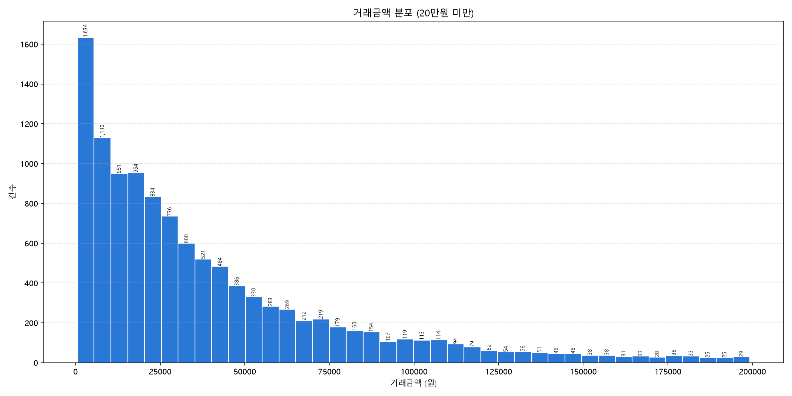

# 거래금액 히스토그램(20만원 미만) 읽는 법

데이터: `data/핀테크_정제완료.csv`, 전체 11,713건 중 20만원 미만 11,293건(96.41%) 대상, 40칸(bin)

---

## 1. 히스토그램이 막대그래프와 다른 점

막대그래프는 "카테고리별 합계·평균"처럼 서로 다른 항목을 비교하지만, 히스토그램은 **하나의 숫자 컬럼(거래금액)을 구간으로 잘라서, 각 구간에 몇 건이 들어가는지**를 보여준다. x축은 카테고리 이름이 아니라 **금액 구간**이고, 막대 사이에 틈이 없는 것도 이 때문이다(연속된 숫자를 나눈 것이라 항목 사이에 "빈 자리"가 없다).

## 2. 왜 20만원 미만만 골랐는가

전체 거래 중 96.41%가 20만원 미만에 몰려 있고, 나머지 3.59%는 최대 112만원대까지 흩어져 있다. 이런 소수의 큰 값을 그대로 넣으면 x축이 억지로 늘어나서 진짜 많이 몰려있는 구간(1~5만원대)이 한 덩어리로 뭉개져 보인다 — 박스플롯에서 이상치를 뺐던 것과 같은 이유다.

## 3. 이번 데이터를 읽으면 보이는 것

- **가장 많이 몰린 구간은 301~5,469원 사이로 1,634건**이다. 이후 구간으로 갈수록(금액이 커질수록) 건수가 점점 줄어든다.
- 중앙값은 26,236원, 평균은 39,280원이다. **평균이 중앙값보다 훨씬 크다** — 이는 소액 결제가 압도적으로 많고, 그보다 큰 금액의 결제가 꼬리처럼 오른쪽으로 길게 늘어져 있다는 뜻이다.
- 이런 모양을 "오른쪽으로 꼬리가 긴 분포(오른쪽 치우침, right-skewed)"라고 부른다. 핀테크 결제 데이터에서는 흔한 패턴인데, 대부분 사람들은 소액 결제(커피, 교통비 등)를 자주 하고 큰 금액 결제(여행, 가전 등)는 가끔만 하기 때문이다.

## 4. 히스토그램을 볼 때 스스로 물어야 할 질문

1. **막대가 한쪽으로 몰려 있는가, 고르게 퍼져 있는가?** — 몰려있으면(이번 데이터처럼) "전형적인 거래 금액대"가 뚜렷하다는 뜻이고, 고르게 퍼져 있으면 특별한 대표값이 없다는 뜻이다.
2. **봉우리(최빈 구간)가 하나인가, 여러 개인가?** — 봉우리가 두 개 이상이면(예: 소액 결제 그룹과 고액 결제 그룹이 따로 있음) 사실은 성격이 다른 두 집단이 섞여 있다는 신호다. 이번 데이터는 봉우리가 하나뿐이라 단일 집단으로 보인다.
3. **평균과 중앙값이 얼마나 차이 나는가?** — 차이가 크면(이번처럼 39,280 vs 26,236) "평균 결제금액"이라는 말만 보고 판단하면 오해하기 쉽다. 중앙값이 실제 "전형적인 한 건"에 더 가깝다.
4. **막대 칸(bin) 개수를 바꾸면 그림이 달라지는가?** — bin이 너무 적으면 뭉개져서 패턴이 안 보이고, 너무 많으면 들쭉날쭉해서 노이즈처럼 보인다. 이번엔 40칸으로 나눠 적당히 세밀하게 봤다.

## 종합

이 히스토그램은 "핀테크 결제는 대부분 1~3만원대 소액이고, 그보다 큰 금액은 갈수록 드물어진다"는 것을 한눈에 보여준다. 평균값만 보고 "고객 1인당 평균 39,280원을 쓴다"고 해석하면, 실제 절반 이상의 결제는 그보다 훨씬 작은 금액이라는 사실을 놓치게 된다 — 이런 왜곡을 피하려고 히스토그램(전체 분포)과 중앙값을 같이 봐야 한다.
